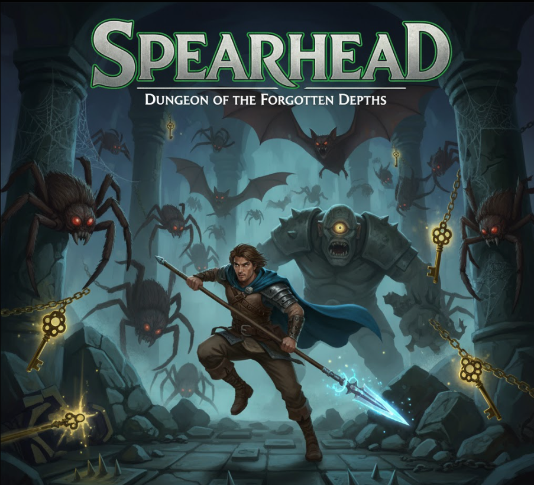

# spearHead

spearHead is an experimental, fast-paced web game built for the Somnia AI Hackathon. It’s powered by Phaser 3, React, and Vite, with optional on‑chain building blocks in Solidity. The goal is to create a delightful, modern game experience that can grow into social, competitive modes and rich player identity — all while staying simple to run and iterate on.

## Why this project
- **Rapid iteration:** Vite + React + Phaser hot-reload for quick gameplay experiments.
- **Modern stack:** TypeScript across the client, clean scene architecture, and a React↔Phaser bridge.
- **On-chain ready:** Example smart contracts for identity and escrow to explore web3-native features.

## AI today and tomorrow
- **Today (experiments):**
  - Prototyping AI-assisted tuning for enemy behaviors and difficulty curves.
  - Exploring lightweight generative prompts for narrative flavor and item descriptions.
- **Future:**
  - An adaptive, learnable AI Boss Monster that counters player patterns over time.
  - Procedural encounter generation and dynamic quest directives.
  - Assistive coaching tips and highlights, powered by gameplay telemetry.
  - Safety tooling for moderation and content filtering.

## Tech stack
- **Client:** Phaser 3, React 19, Vite 6, TypeScript 5
- **Contracts:** Solidity ^0.8.20

## Repository structure
- **client/** — React + Phaser app (development server, build, assets)
- **contracts/** — Example Solidity contracts
  - `NamingRegistry.sol` — Simple username registry per address
  - `Escrow.sol` — Minimal ETH escrow flow with release/refund

## Quick start
1. Install Node.js (LTS recommended).
2. Install client deps:
   - `cd client`
   - `npm install`
3. Start dev server:
   - `npm run dev`
   - Open the URL shown in the terminal (defaults to http://localhost:8080)
4. Build for production:
   - `npm run build` (outputs to `client/dist`)

For full client usage details, see `client/README.md`.

## How to Play

### Controls

| Keys | Description |
|------|-------------|
| Arrow Keys (Up, Down, Left, Right) | Moves the player. Navigate menu. |
| Z | Attack |
| X | Lift/Throw |
| Enter | Select menu option. |

## Smart contracts (optional)
The `contracts/` folder includes small, standalone examples:
- **NamingRegistry** — Set and read a name for a wallet address.
- **Escrow** — Lock ETH, then release to payee or refund to payer. Includes basic reentrancy protection.

These are provided as references for future gameplay and economy ideas. You can deploy them to a testnet or local chain and wire them into the client when needed.

## Vision and roadmap
spearHead is designed to evolve. Upcoming ideas we’re excited about:
- **Face cam integration**
  - Optional, privacy‑first face cam overlays for reactions, streams, and clips.
  - Fun cosmetic effects and emotes driven by face gestures.
- **Multiplayer mode**
  - Real‑time matchmaking, parties, and spectate modes.
  - Solid netcode foundations with client prediction and reconciliation.
- **Battle Royale (“Royal Battles”)**
  - Large lobbies, shrinking arenas, and dynamic events.
  - Seasonal ladders, tournaments, and highlight reels.
- **Player identity & progression**
  - Profiles, names (on/off‑chain), cosmetics, achievements.
  - Leaderboards and social presence.
- **Creator & economy tools**
  - Map/mod tools, shareable scenarios.
  - Optional web3 hooks (e.g., `Escrow.sol`) for peer‑to‑peer prizes or marketplace flows.
- **Quality & accessibility**
  - Mobile-friendly touch controls.
  - Inclusive settings and performance modes.

All of the above is additive and opt‑in. The core experience remains fast, approachable, and fun.

## Contributing
- Keep changes small and focused.
- Prefer TypeScript for client code and clean scene boundaries.
- Open an issue or draft PR to propose new features or integration points (e.g., face cam, multiplayer APIs, netcode, or on‑chain hooks).

## License
- The client template includes its own `client/LICENSE` file.
- Contracts and additional code may adopt a compatible open-source license in the root in the future.

## Credits and acknowledgments
- Press Start 2P Font — Author: CodeMan38 — Link: Google Fonts
- Player — Author: Foozle — Asset: Legend Main Character
- Enemies — Author: Foozle — Asset: Legend Enemy Pack 1
- Dungeon Pack — Author: Foozle — Asset: Legend Spider Dungeon
- UI Icons — Author: Foozle — Asset: Legend UI Icons

Inspiration credit to Scott Westover:
https://github.com/devshareacademy/phaser-zelda-like-tutorial

— Excited for what comes next. Let’s build something players love.
